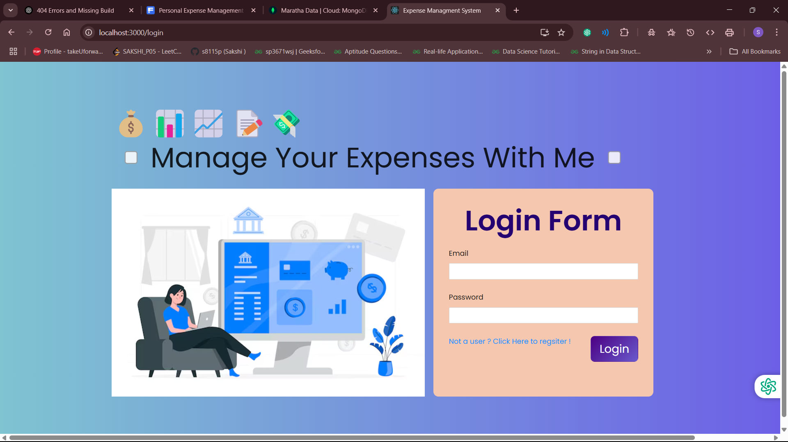
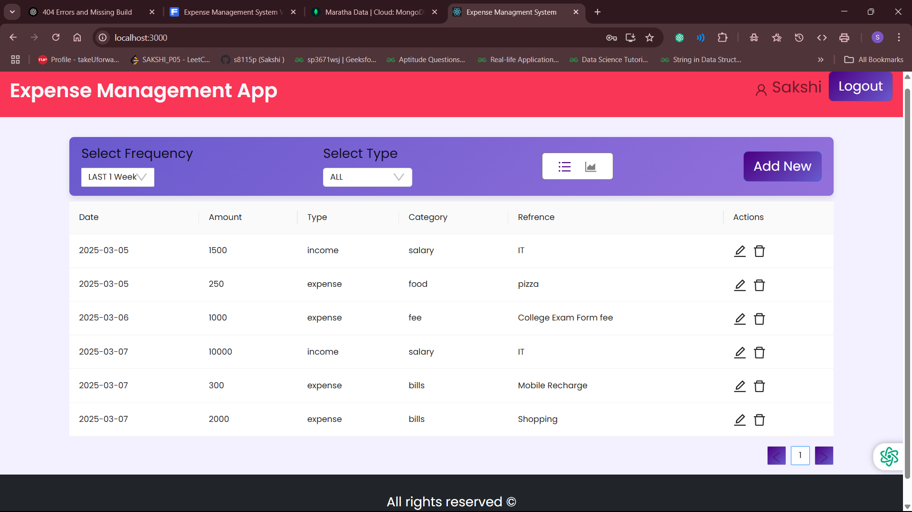
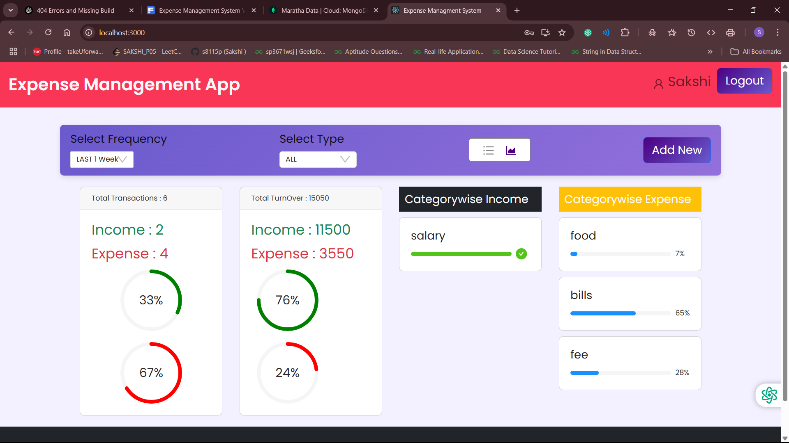

# 📊 Personal Finance Management System

An intuitive, secure, and real-time **Expense Management System** built with the **MERN Stack** (MongoDB, Express.js, React.js, Node.js). This system helps users track income and expenses, visualize spending patterns, and make smarter financial decisions — all in one place.

> 🛠️ Developed as part of a 6-week internship under the **NextGen Employability Program** (AICTE + Edunet Foundation + EY GDS).

---

## 🚀 Features

- 🔐 **User Authentication** with secure login & registration
- 💸 **CRUD operations** for income and expense entries
- 📈 **Analytics Dashboard** with visual reports (charts, filters)
- 📅 Filter by **date range**, category, or transaction type
- 🧠 Real-time updates with a responsive UI
- 🛡️ Backend validation, input checks, and MongoDB schema enforcement

---

## 🧱 Tech Stack

| Layer         | Technology                                   |
|---------------|----------------------------------------------|
| Frontend      | React.js, HTML5, CSS3, Bootstrap, Ant Design |
| Backend       | Node.js, Express.js                          |
| Database      | MongoDB (via Mongoose ORM)                   |
| Testing & Dev | Postman, Nodemon                             |
| Hosting       | Backend - [Render](https://backend-whtf.onrender.com) |

---

## 📸 Demo Screenshots

### 🧑‍💼 Login Page

### 📝 Register Page

### 💰 Dashboard - Table View

### 📊 Dashboard - Analytics View

---

## 🧭 System Flow

\`\`\`plaintext
User → Auth (JWT) → Dashboard
         ↳ View/Add/Edit/Delete Transactions
         ↳ Filter by Category/Date/Type
         ↳ Visual Summary (Charts + Tables)
\`\`\`

---

## 📌 Future Enhancements

- 💳 Expense categorization using NLP
- 📤 Export transactions to PDF/CSV
- 🔔 Smart savings & budget alerts
- 🌐 Multi-user family/group account support

---

## 👩‍💻 Developed By

**Sakshi Santosh Patil**  
Full-stack enthusiast | Data lover | GenAI explorer

---

## 📝 License

This project is open-source for educational & showcase purposes. For any reuse or deployment, kindly reach out or fork responsibly.
